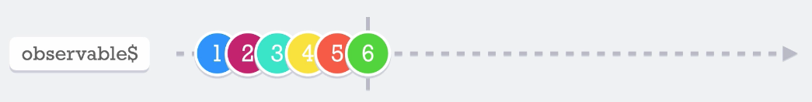

# of
El __of__ es un método que nos permite crear observables en base a un listado de elementos

Ejemplo: 
```javascript
of(1, 2, 3, 4, 5, 6)
```

Lo importante de este método es que va emitir los valores en secuencia, uno por uno y de manera síncrona y cuando ha emitido el último valor automáticamente se completa el observable.


