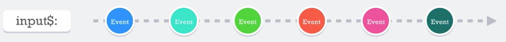

# fromEvent
Nos permite crear __Observables__ en función de un __Event target__, por ejemplo podemos seleccionar el event target del 'document' y solo queremos los de tipo 'scroll'

```javascript
fromEvent(document, 'scroll)
```
Teóricamente este no tiene fin de este __fromEvent__, aunque se puede cancelar, anular subcripción, ...

