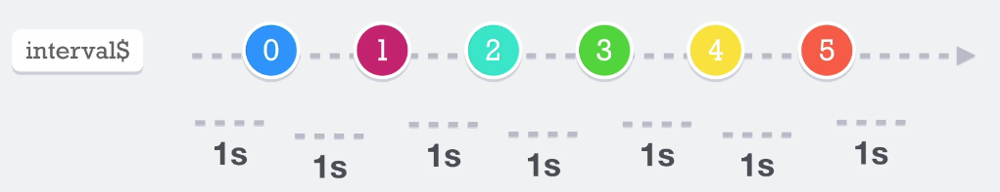
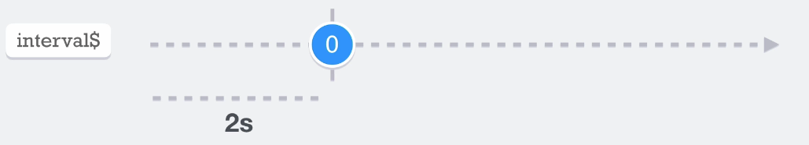

# Interval

Nos permite crear observables de intervalos de tiempo, por ejemplo podemos tener

```javascript
interval(1000)
```
Al subscribirnos al observable que se genera mediante el __interval__, tendríamos una secuencia de valores que empiezan en 0 hasta el fin de los tiempo...
Hay que tener en cuenta que son observables asincronos.




# Timer

Es muy parecido al interval, lo que diferencia al __interval__ es, si tenemos por ejemplo
```javascript
timer(2000)
```
Lo que significa es que dentro de 2s se va emitir el primer valor y se va a completar dicho observable y no se van a seguir emitiendo valores

NOTA: 
* si utilizamos timer(0), significa que queremos que se ejecute instantaneamente, pero en realidad significa que se emita tan pronto como JS o call stack lo permita.
* Nos permite programar cuando se quiere emitir utilizando un date como único parámetros
* cuando le pasamos dos valores al timer:
  ```javascript
  timer(2000, 1000)
  ```
  Lo que indicamos es como generar un **interval**, empiza a los dos segundos y emite cada segundo.

