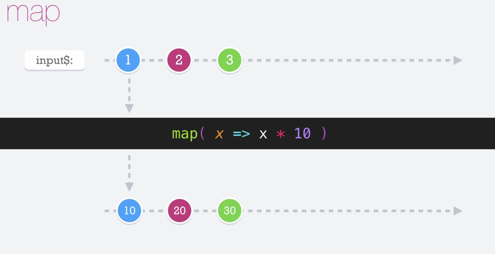

# Map

El operador __map__ nos permite transformar el dato que recibimos del observable, en algo que nos interesa a nosotros. Puede trabajar con cualquier tipo de dato de entrada y puede emitir cualquiet tipo de dato en su salida.

