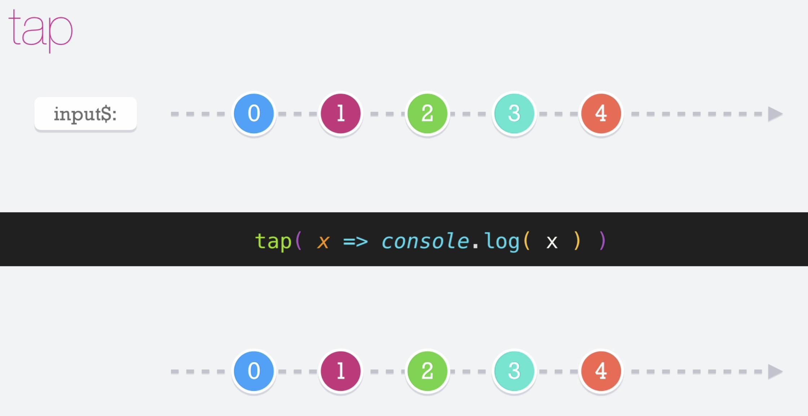

# Tap

El operador __tap__ nos ayuda a ver como va fluyendo la informción a través de nuestros observables. Nos permite disparar efectos secundarios, pero hay que tener cuidado, ya que nos puede provocar accidentalmente lanzar acciones sin querer.

NOTA: también nos puede servir como depurador, para conocer que sucede en el pipe.

