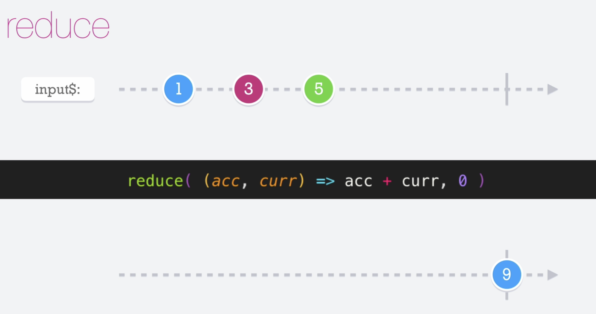

# Reduce

El operador __reduce__ hace lo mismo que hace el reduce de JS. En resumen aplica una función acumuladora a las emisiones producidas por el observable. Solo se emitirá el valor total hasta que el observable se completa.

