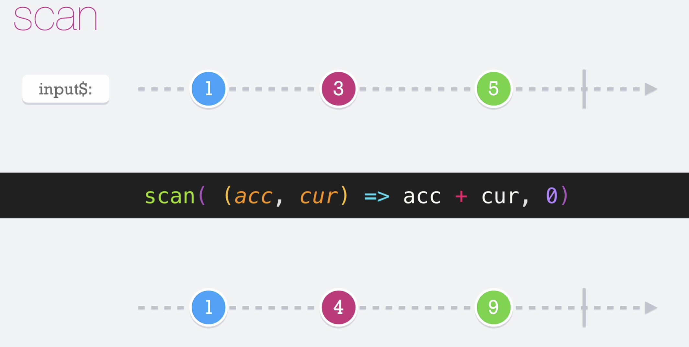

# Scan

El operador scan hace lo mismo que hace el reduce, con una diferencia, que cuando los valores son emitidos por el observable inmediatamente van saliendo conforme van ingresando pero regresa su valor acumulador.

