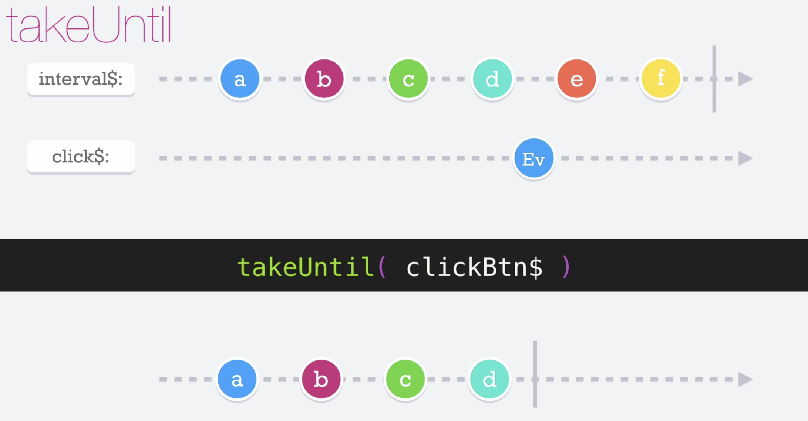

# Take Until

El operador __takeUntil__ recibe como argumento otro observable, va emitiendo hasta que el observable que recibe por parámetros emite algún valor sin importar que el observable principal siga emitiendo valores.

