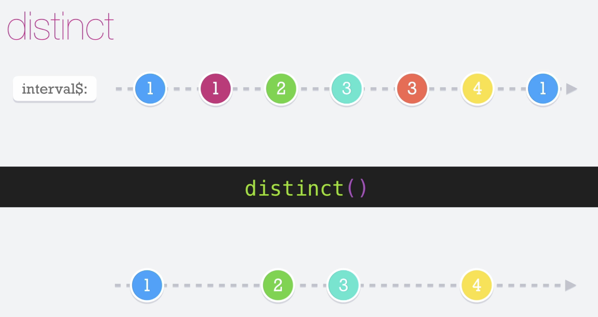

# Distinct

El operador __distinct__ nos permite pasar únicamente los valores que no han sido previamente emitidos por el observables.
Hay que tener en cuenta que el dicho operador, utiliza el operador de equidad (===).

