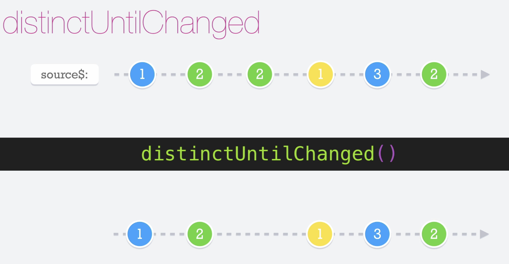

# Distinct Until Change

El operador __distinctUntilChange__ es muy parecido al operador __distinct__, pero tiene una diferencia y es que el __distinctUntilChange__ emite valores siempre y cuando la emisión anterior no sea la misma

