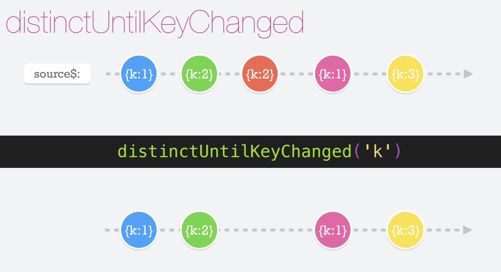

# Debounce Time

El operador __debounceTime__ trabaja con intervalos de tiempo, cual nos ayuda a que podamos contar cuántes milésimas de segundo han pasado desde la última emisión y si sobrepasan el tiempo asignado, emitirá el valor recibido. Este operador nos puede ayudar a poder restringir la cantidad de emisiones que nuestro observable inicial está emitiendo.

