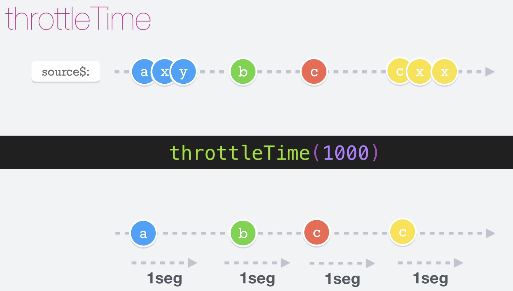

# Throttle Time

El operador __throttleTime__ es un operador muy parecido al debounceTime pero funciona un poquito diferente.
En este caso, cuando el observable emite, empieza a contar N milisegundos, durante este tiempo si el observable sigue emitiendo datos estos serán ignorados, solo volverá a emitir pasado el tiempo indicado.

