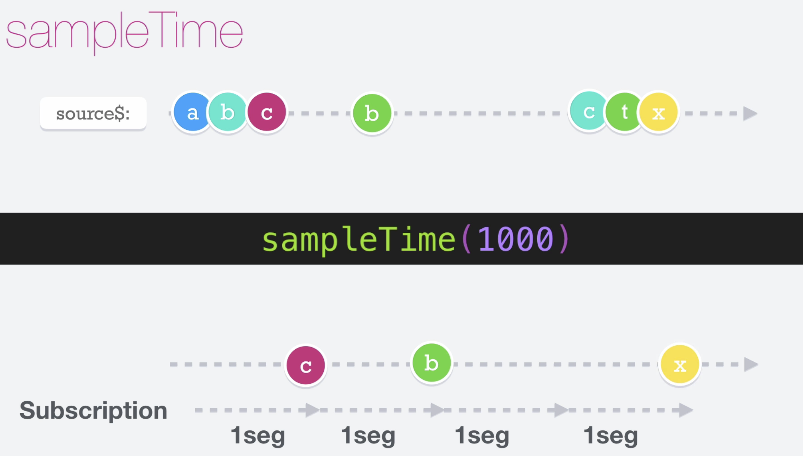

# Sample Time

El operador __sampleTime__ nos permite obtener el último valor emitido en un intervalo de tiempo. Por lo tanto, nos permite tener una subscripción que está pendiente de cada una de sus emisiones en un periodo de tiempo.

