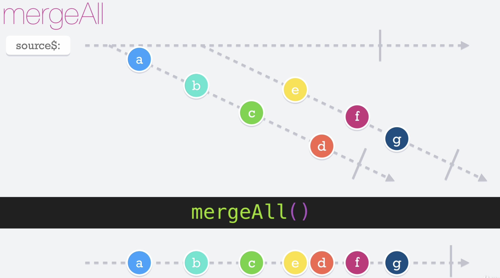

# Merge All

El operador __mergeAll__ nos sirve para operar con observables que devuelve otros observables internamente, Conoce todos los observables a los que estás subscrito y por lo tanto, solo se emitirá el complete cuando todos los observables paren de emitir.

