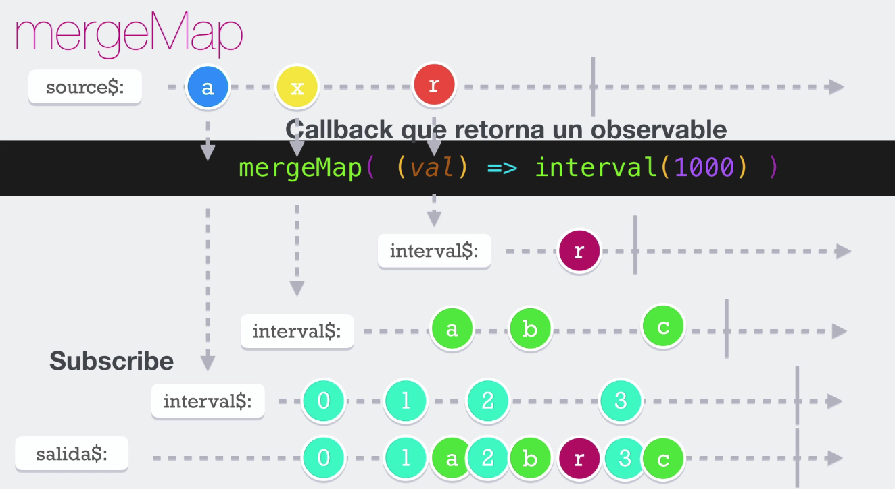

# Merge Map

El operador __mergeMap__ va a recibir el valor que se ha emitido de nuestro observer inicial y regresa un nuveo observer.
Recordar que los operadores de aplanamiento, cuando ven que retornan un observable, realmente no van a transferir el objeto al subscribe o al siguiente operador, lo que retornan o emitirán cuando fluya a través de él es el valor producto de la subscripción interna. El mergerMap no tiene límites de subscripciones internas y todas pueden estar activas simultáneamente.

