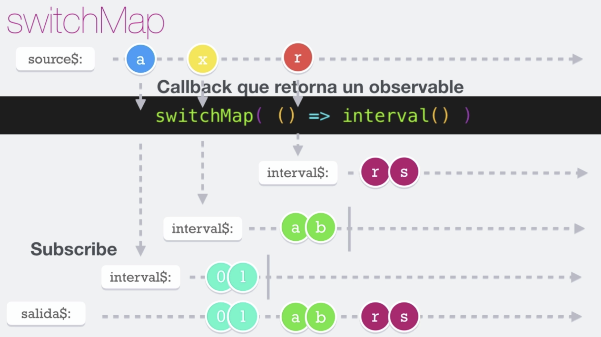

# Switch Map

El operador __switchMap__ es muy parecido al **mergeMap**, recibe un callback y devuelve un observable y este nuevo observable es quien se va a subscribir para hacer la emisión de la salida.

