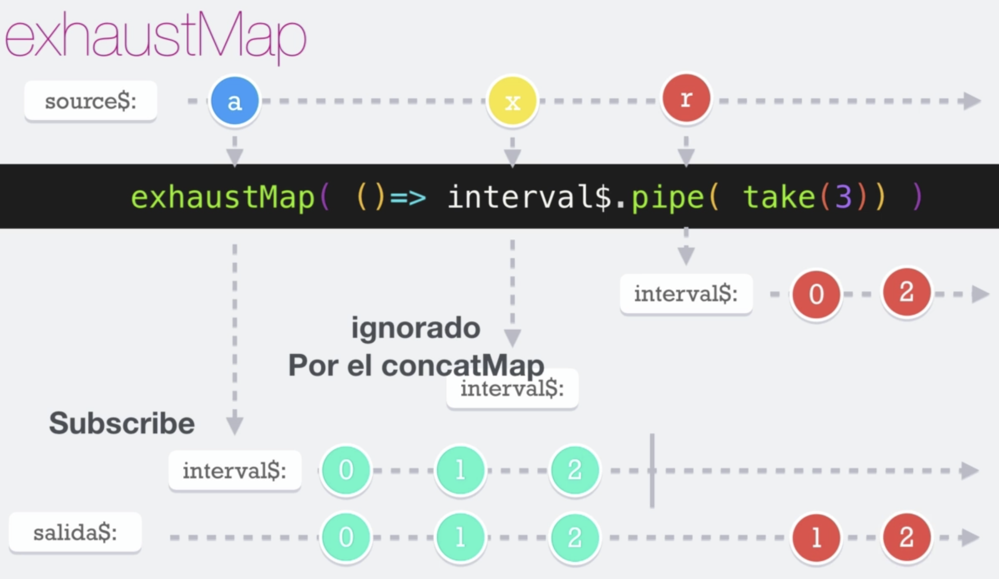

# Exhaust Map

El operador __exhaustMap__ es otro operador de aplanamiento, es decir recibe un observador y maneja la subscripción. Es muy parecido al **concatMap**, pero si se encuentra subscrito a un observable y le llega otro, omite este último que ha llegado porque se encutra en curso con el anterior.

