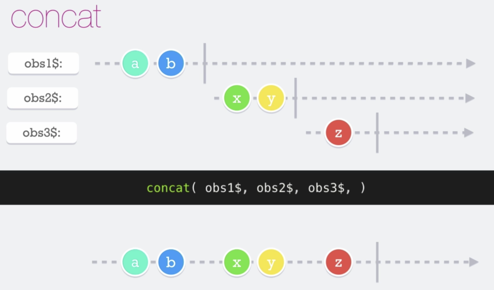

# Concat

El __concat__ es una función que recibe como argumentos un observable, iterables o un array. Se utiliza para trabajar con observables, con dichos observables el **concat** va a crear un nuevo observable.

NOTA: si un observable nunca se completa, los otros observables que están en colo nunca emitirán.

