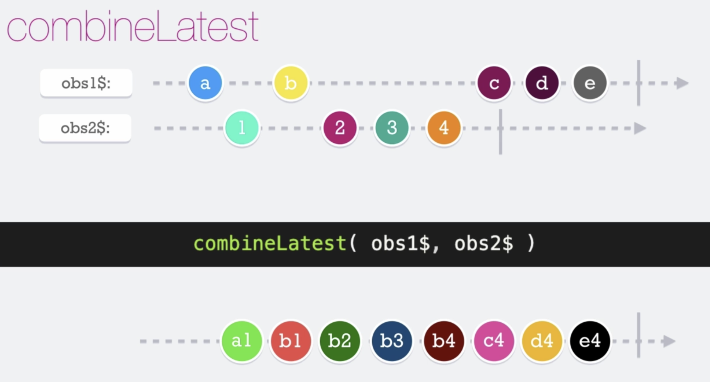

# Combine Latest

El __combineLatest__ es una función que nos permite mandar observables como argumentos y combinarlos y emitir sus valores de todos los observables internos simultáneamente. Recalcar que el **combineLatest** regresa un nuevo observable, el cual va emitir los valores hasta que todos los observables internos hayan emitido por lo menos un valor.

