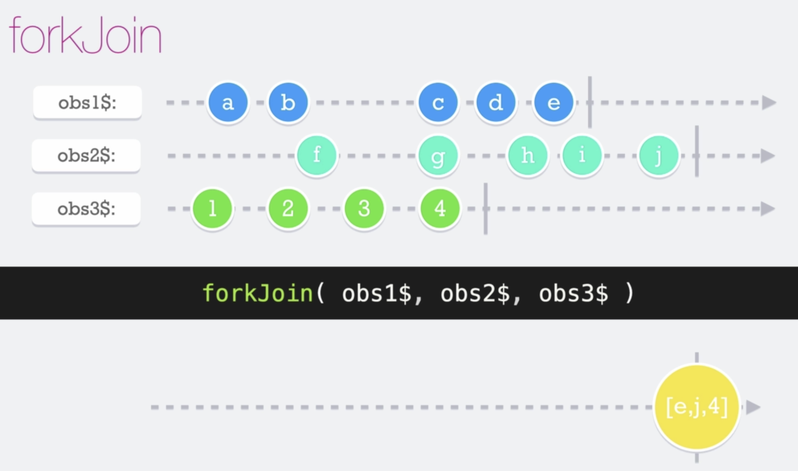

# Fork Join

El __forkJoin__ es una función que puede recibir varios observables como argumentos para trabajar. Hay que tener en cuenta que dichos observables deben ser finitos, porque sino no emite el forkJoin.

